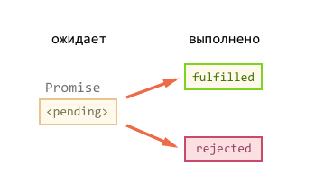
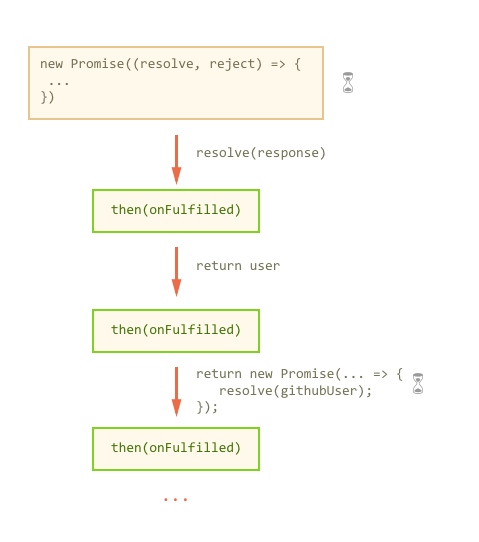
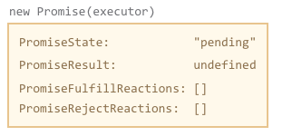
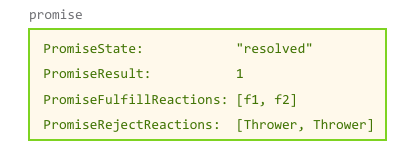
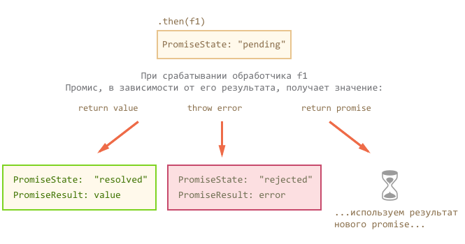
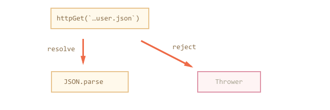
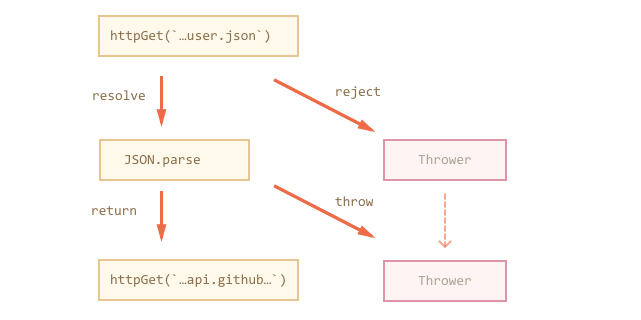
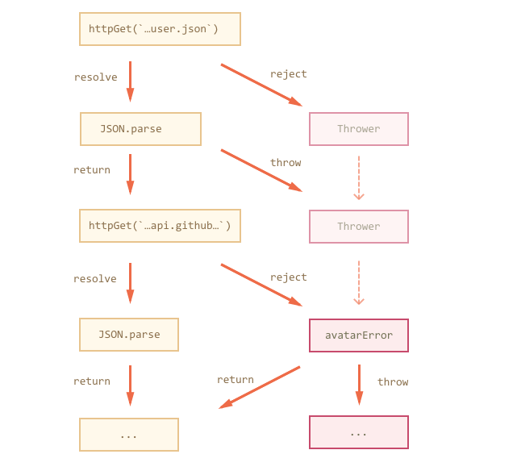

# Promise

Promise (обычно их так и называют "промисы") -- предоставляют удобный способ организации асинхронного кода.

В современном JavaScript промисы часто используются в том числе и неявно, при помощи генераторов, но об этом чуть позже.

## Что такое Promise?

Promise -- это специальный объект, который содержит своё состояние. Вначале `pending` ("ожидание"), затем -- одно из: `fulfilled` ("выполнено успешно") или `rejected` ("выполнено с ошибкой").



На `promise` можно навешивать коллбэки двух типов:

- `onFulfilled` -- срабатывают, когда `promise` в состоянии "выполнен успешно".
- `onRejected` -- срабатывают, когда `promise` в состоянии "выполнен с ошибкой".

Способ использования, в общих чертах, такой:

1. Код, которому надо сделать что-то асинхронно, создаёт объект `promise` и возвращает его.
2. Внешний код, получив `promise`, навешивает на него обработчики.
3. По завершении процесса асинхронный код переводит `promise` в состояние `fulfilled` (с результатом) или `rejected` (с ошибкой). При этом автоматически вызываются соответствующие обработчики во внешнем коде.

Синтаксис создания `Promise`:

```js
var promise = new Promise(function(resolve, reject) {
  // Эта функция будет вызвана автоматически

  // В ней можно делать любые асинхронные операции,
  // А когда они завершатся — нужно вызвать одно из:
  // resolve(результат) при успешном выполнении
  // reject(ошибка) при ошибке
})
```

Универсальный метод для навешивания обработчиков:

```js
promise.then(onFulfilled, onRejected)
```

- `onFulfilled` -- функция, которая будет вызвана с результатом при `resolve`.
- `onRejected` -- функция, которая будет вызвана с ошибкой при `reject`.

С его помощью можно назначить как оба обработчика сразу, так и только один:

```js
// onFulfilled сработает при успешном выполнении
promise.then(onFulfilled)
// onRejected сработает при ошибке
promise.then(null, onRejected)
```

```smart header=".catch"
Для того, чтобы поставить обработчик только на ошибку, вместо `.then(null, onRejected)` можно написать `.catch(onRejected)` -- это то же самое.
```

````smart header="Синхронный `throw` -- то же самое, что `reject`"
Если в функции промиса происходит синхронный `throw` (или иная ошибка), то вызывается `reject`:
```js run
'use strict';

let p = new Promise((resolve, reject) => {
  // то же что reject(new Error("o_O"))
  throw new Error("o_O");
})

p.catch(alert); // Error: o_O
```
````

Посмотрим, как это выглядит вместе, на простом примере.

## Пример с setTimeout

Возьмём `setTimeout` в качестве асинхронной операции, которая должна через некоторое время успешно завершиться с результатом "result":

```js run
'use strict';

// Создаётся объект promise
let promise = new Promise((resolve, reject) => {

  setTimeout(() => {
    // переведёт промис в состояние fulfilled с результатом "result"
    resolve("result");
  }, 1000);

});

// promise.then навешивает обработчики на успешный результат или ошибку
promise
  .then(
    result => {
      // первая функция-обработчик - запустится при вызове resolve
      alert("Fulfilled: " + result); // result - аргумент resolve
    },
    error => {
      // вторая функция - запустится при вызове reject
      alert("Rejected: " + error); // error - аргумент reject
    }
  );
```

В результате запуска кода выше -- через 1 секунду выведется "Fulfilled: result".

А если бы вместо `resolve("result")` был вызов `reject("error")`, то вывелось бы "Rejected: error". Впрочем, как правило, если при выполнении возникла проблема, то `reject` вызывают не со строкой, а с объектом ошибки типа `new Error`:

```js run
// Этот promise завершится с ошибкой через 1 секунду
var promise = new Promise((resolve, reject) => {

  setTimeout(() => {
*!*
    reject(new Error("время вышло!"));
*/!*
  }, 1000);

});

promise
  .then(
    result => alert("Fulfilled: " + result),
*!*
    error => alert("Rejected: " + error.message) // Rejected: время вышло!
*/!*
  );
```

Конечно, вместо `setTimeout` внутри функции промиса может быть и запрос к серверу и ожидание ввода пользователя, или другой асинхронный процесс. Главное, чтобы по своему завершению он вызвал `resolve` или `reject`, которые передадут результат обработчикам.

```smart header="Только один аргумент"
Функции `resolve/reject` принимают ровно один аргумент -- результат/ошибку.

Именно он передаётся обработчикам в `.then`, как можно видеть в примерах выше.
```

## Promise после reject/resolve -- неизменны

Заметим, что после вызова `resolve/reject` промис уже не может "передумать".

Когда промис переходит в состояние "выполнен" -- с результатом (resolve) или ошибкой (reject) -- это навсегда.

Например:

```js run
'use strict';

let promise = new Promise((resolve, reject) => {

*!*
  // через 1 секунду готов результат: result
*/!*
  setTimeout(() => resolve("result"), 1000);

*!*
  // через 2 секунды — reject с ошибкой, он будет проигнорирован
*/!*
  setTimeout(() => reject(new Error("ignored")), 2000);

});

promise
  .then(
    result => alert("Fulfilled: " + result), // сработает
    error => alert("Rejected: " + error) // не сработает
  );
```

В результате вызова этого кода сработает только первый обработчик `then`, так как после вызова `resolve` промис уже получил состояние (с результатом), и в дальнейшем его уже ничто не изменит.

Последующие вызовы resolve/reject  будут просто проигнорированы.

А так -- наоборот, ошибка будет раньше:

```js run
'use strict';

let promise = new Promise((resolve, reject) => {

  // reject вызван раньше, resolve будет проигнорирован
  setTimeout(() => reject(new Error("error")), 1000);

  setTimeout(() => resolve("ignored"), 2000);

});

promise
  .then(
    result => alert("Fulfilled: " + result), // не сработает
    error => alert("Rejected: " + error) // сработает
  );
```

## Промисификация

*Промисификация* -- это когда берут асинхронный функционал и делают для него обёртку, возвращающую промис.

После промисификации использование функционала зачастую становится гораздо удобнее.

В качестве примера сделаем такую обёртку для запросов при помощи XMLHttpRequest.

Функция `httpGet(url)` будет возвращать промис, который при успешной загрузке данных с `url` будет переходить в `fulfilled` с этими данными, а при ошибке -- в `rejected` с информацией об ошибке:

```js autorun
function httpGet(url) {

  return new Promise(function(resolve, reject) {

    var xhr = new XMLHttpRequest();
    xhr.open('GET', url, true);

    xhr.onload = function() {
      if (this.status == 200) {
*!*
        resolve(this.response);
*/!*
      } else {
*!*
        var error = new Error(this.statusText);
        error.code = this.status;
        reject(error);
*/!*
      }
    };

    xhr.onerror = function() {
*!*
      reject(new Error("Network Error"));
*/!*
    };

    xhr.send();
  });

}
```

Как видно, внутри функции объект `XMLHttpRequest` создаётся и отсылается как обычно, при `onload/onerror` вызываются, соответственно, `resolve` (при статусе 200) или `reject`.

Использование:

```js run
httpGet("/article/promise/user.json")
  .then(
    response => alert(`Fulfilled: ${response}`),
    error => alert(`Rejected: ${error}`)
  );
```

```smart header="Метод `fetch`"
Заметим, что ряд современных браузеров уже поддерживает [fetch](/fetch) -- новый встроенный метод для AJAX-запросов, призванный заменить XMLHttpRequest. Он гораздо мощнее, чем `httpGet`. И -- да, этот метод использует промисы. Полифилл для него доступен на <https://github.com/github/fetch>.
```

## Цепочки промисов

"Чейнинг" (chaining), то есть возможность строить асинхронные цепочки из промисов -- пожалуй, основная причина, из-за которой существуют и активно используются промисы.

Например, мы хотим по очереди:

1. Загрузить данные посетителя с сервера (асинхронно).
2. Затем отправить запрос о нём на github (асинхронно).
3. Когда это будет готово, вывести его github-аватар на экран (асинхронно).
4. ...И сделать код расширяемым, чтобы цепочку можно было легко продолжить.

Вот код для этого, использующий функцию `httpGet`, описанную выше:

```js run
'use strict';

// сделать запрос
httpGet('/article/promise/user.json')
*!*
  // 1. Получить данные о пользователе в JSON и передать дальше
*/!*
  .then(response => {
    console.log(response);
    let user = JSON.parse(response);
*!*
    return user;
*/!*
  })
*!*
  // 2. Получить информацию с github
*/!*
  .then(user => {
    console.log(user);
*!*
    return httpGet(`https://api.github.com/users/${user.name}`);
*/!*
  })
*!*
  // 3. Вывести аватар на 3 секунды (можно с анимацией)
*/!*
  .then(githubUser => {
    console.log(githubUser);
    githubUser = JSON.parse(githubUser);

    let img = new Image();
    img.src = githubUser.avatar_url;
    img.className = "promise-avatar-example";
    document.body.appendChild(img);

*!*
    setTimeout(() => img.remove(), 3000); // (*)
*/!*
  });
```

Самое главное в этом коде -- последовательность вызовов:

```js
httpGet(...)
  .then(...)
  .then(...)
  .then(...)
```

При чейнинге, то есть последовательных вызовах `.then…then…then`, в каждый следующий `then` переходит результат от предыдущего. Вызовы `console.log` оставлены, чтобы при запуске можно было посмотреть конкретные значения, хотя они здесь и не очень важны.

**Если очередной `then` вернул промис, то далее по цепочке будет передан не сам этот промис, а его результат.**

В коде выше:

1. Функция в первом `then` возвращает "обычное" значение `user`. Это значит, что `then` возвратит промис в состоянии "выполнен" с `user` в качестве результата. Он станет аргументом в следующем `then`.
2. Функция во втором `then` возвращает промис (результат нового вызова `httpGet`). Когда он будет завершён (может пройти какое-то время), то будет вызван следующий `then` с его результатом.
3. Третий `then` ничего не возвращает.

Схематично его работу можно изобразить так:



Значком "песочные часы" помечены периоды ожидания, которых всего два: в исходном `httpGet` и в подвызове далее по цепочке.

Если `then` возвращает промис, то до его выполнения может пройти некоторое время, оставшаяся часть цепочки будет ждать.

То есть, логика довольно проста:

- В каждом `then` мы получаем текущий результат работы.
- Можно его обработать синхронно и вернуть результат (например, применить `JSON.parse`). Или же, если нужна асинхронная обработка -- инициировать её и вернуть промис.

Обратим внимание, что последний `then` в нашем примере ничего не возвращает. Если мы хотим, чтобы после `setTimeout` `(*)` асинхронная цепочка могла быть продолжена, то последний `then` тоже должен вернуть промис. Это общее правило: если внутри `then` стартует новый асинхронный процесс, то для того, чтобы оставшаяся часть цепочки выполнилась после его окончания, мы должны вернуть промис.

В данном случае промис должен перейти в состояние "выполнен" после срабатывания `setTimeout`.

Строку `(*)` для этого нужно переписать так:
```js
.then(githubUser => {
  ...

  // вместо setTimeout(() => img.remove(), 3000); (*)

  return new Promise((resolve, reject) => {
    setTimeout(() => {
      img.remove();
      // после таймаута — вызов resolve,
      // можно без результата, чтобы управление перешло в следующий then
      // (или можно передать данные пользователя дальше по цепочке)
*!*
      resolve();
*/!*
    }, 3000);
  });
})
```

Теперь, если к цепочке добавить ещё `then`, то он будет вызван после окончания `setTimeout`.

## Перехват ошибок

Выше мы рассмотрели "идеальный случай" выполнения, когда ошибок нет.

А что, если github не отвечает? Или JSON.parse бросил синтаксическую ошибку при обработке данных?

Да мало ли, где ошибка...

Правило здесь очень простое.

**При возникновении ошибки -- она отправляется в ближайший обработчик `onRejected`.**

Такой обработчик нужно поставить через второй аргумент `.then(..., onRejected)` или, что то же самое, через `.catch(onRejected)`.

Чтобы поймать всевозможные ошибки, которые возникнут при загрузке и обработке данных, добавим `catch` в конец нашей цепочки:

```js run
'use strict';

*!*
// в httpGet обратимся к несуществующей странице
*/!*
httpGet('/page-not-exists')
  .then(response => JSON.parse(response))
  .then(user => httpGet(`https://api.github.com/users/${user.name}`))
  .then(githubUser => {
    githubUser = JSON.parse(githubUser);

    let img = new Image();
    img.src = githubUser.avatar_url;
    img.className = "promise-avatar-example";
    document.body.appendChild(img);

    return new Promise((resolve, reject) => {
      setTimeout(() => {
        img.remove();
        resolve();
      }, 3000);
    });
  })
*!*
  .catch(error => {
    alert(error); // Error: Not Found
  });
*/!*
```

В примере выше ошибка возникает в первом же `httpGet`, но `catch` с тем же успехом поймал бы ошибку во втором `httpGet` или в `JSON.parse`.

Принцип очень похож на обычный `try..catch`: мы делаем асинхронную цепочку из `.then`, а затем, в том месте кода, где нужно перехватить ошибки, вызываем `.catch(onRejected)`.

```smart header="А что после `catch`?"
Обработчик `.catch(onRejected)` получает ошибку и должен обработать её.

Есть два варианта развития событий:

1. Если ошибка не критичная, то `onRejected` возвращает значение через `return`, и управление переходит в ближайший `.then(onFulfilled)`.
2. Если продолжить выполнение с такой ошибкой нельзя, то он делает `throw`, и тогда ошибка переходит в следующий ближайший `.catch(onRejected)`.

Это также похоже на обычный `try..catch` -- в блоке `catch` ошибка либо обрабатывается, и тогда выполнение кода продолжается как обычно, либо он делает `throw`. Существенное отличие -- в том, что промисы асинхронные, поэтому при отсутствии внешнего `.catch` ошибка не "вываливается" в консоль и не "убивает" скрипт.

Ведь возможно, что новый обработчик `.catch` будет добавлен в цепочку позже.
```

## Промисы в деталях

Самым основным источником информации по промисам является, разумеется, [стандарт](http://www.ecma-international.org/ecma-262/6.0/index.html#sec-promise-objects).

Чтобы наше понимание промисов было полным, и мы могли с лёгкостью разрешать сложные ситуации, посмотрим внимательнее, что такое промис и как он работает, но уже не в общих словах, а детально, в соответствии со стандартом ECMAScript.

Согласно стандарту, у объекта `new Promise(executor)` при создании есть четыре внутренних свойства:

- `PromiseState` -- состояние, вначале "pending".
- `PromiseResult` -- результат, при создании значения нет.
- `PromiseFulfillReactions` -- список функций-обработчиков успешного выполнения.
- `PromiseRejectReactions` -- список функций-обработчиков ошибки.



Когда функция-executor вызывает `reject` или `resolve`, то `PromiseState` становится `"resolved"` или `"rejected"`, а все функции-обработчики из соответствующего списка перемещаются в специальную системную очередь `"PromiseJobs"`.

Эта очередь автоматически выполняется, когда интерпретатору "нечего делать".  Иначе говоря, все функции-обработчики выполнятся асинхронно, одна за другой, по завершении текущего кода, примерно как `setTimeout(..,0)`.

Исключение из этого правила -- если `resolve` возвращает другой `Promise`. Тогда дальнейшее выполнение ожидает его результата (в очередь помещается специальная задача), и функции-обработчики выполняются уже с ним.

Добавляет обработчики в списки один метод: `.then(onResolved, onRejected)`. Метод `.catch(onRejected)` -- всего лишь сокращённая запись `.then(null, onRejected)`.

Он делает следующее:

- Если `PromiseState == "pending"`, то есть промис ещё не выполнен, то обработчики добавляются в соответствующие списки.
- Иначе обработчики сразу помещаются в очередь на выполнение.

Здесь важно, что обработчики можно добавлять в любой момент. Можно до выполнения промиса (они подождут), а можно -- после (выполнятся в ближайшее время, через асинхронную очередь).

Например:

```js run
// Промис выполнится сразу же
var promise = new Promise((resolve, reject) => resolve(1));

// PromiseState = "resolved"
// PromiseResult = 1

// Добавили обработчик к выполненному промису
promise.then(alert); // ...он сработает тут же
```

Разумеется, можно добавлять и много обработчиков на один и тот же промис:

```js run
// Промис выполнится сразу же
var promise = new Promise((resolve, reject) => resolve(1));

promise.then( function f1(result) {
*!*
  alert(result); // 1
*/!*
  return 'f1';
})

promise.then( function f2(result) {
*!*
  alert(result); // 1
*/!*
  return 'f2';
})
```

Вид объекта `promise` после этого:



На этой иллюстрации можно увидеть добавленные нами обработчики `f1`, `f2`, а также -- автоматические добавленные обработчики ошибок `"Thrower"`.

Дело в том, что `.then`, если один из обработчиков не указан, добавляет его "от себя", следующим образом:

- Для успешного выполнения -- функция `Identity`, которая выглядит как `arg => arg`, то есть возвращает аргумент без изменений.
- Для ошибки -- функция `Thrower`, которая выглядит как `arg => throw arg`, то есть генерирует ошибку.

Это, по сути дела, формальность, но без неё некоторые особенности поведения промисов могут "не сойтись" в общую логику, поэтому мы упоминаем о ней здесь.

Обратим внимание, в этом примере намеренно *не используется чейнинг*. То есть, обработчики добавляются именно на один и тот же промис.

Поэтому оба `alert` выдадут одно значение `1`.

Все функции из списка обработчиков вызываются с результатом промиса, одна за другой. Никакой передачи результатов между обработчиками в рамках одного промиса нет, а сам результат промиса (`PromiseResult`) после установки не меняется.

Поэтому, чтобы продолжить работу с результатом, используется чейнинг.

**Для того, чтобы результат обработчика передать следующей функции, `.then` создаёт новый промис и возвращает его.**

В примере выше создаётся два таких промиса (т.к. два вызова `.then`), каждый из которых даёт свою ветку выполнения:


Изначально эти новые промисы -- "пустые", они ждут. Когда в будущем выполнятся обработчики `f1, f2`, то их результат будет передан в новые промисы по стандартному принципу:

- Если вернётся обычное значение (не промис), новый промис перейдёт в `"resolved"` с ним.
- Если был `throw`, то новый промис перейдёт в состояние `"rejected"` с ошибкой.
- Если вернётся промис, то используем его результат (он может быть как `resolved`, так и `rejected`).



Дальше выполнятся уже обработчики на новом промисе, и так далее.

Чтобы лучше понять происходящее, посмотрим на цепочку, которая получается в процессе написания кода для показа github-аватара.

Первый промис и обработка его результата:

```js
httpGet('/article/promise/user.json')
  .then(JSON.parse)
```



Если промис завершился через `resolve`, то результат -- в `JSON.parse`, если `reject` -- то в Thrower.

Как было сказано выше, `Thrower` -- это стандартная внутренняя функция, которая автоматически используется, если второй обработчик не указан.

Можно считать, что второй обработчик выглядит так:

```js
httpGet('/article/promise/user.json')
  .then(JSON.parse, *!*err => throw err*/!*)
```

Заметим, что когда обработчик в промисах делает `throw` -- в данном случае, при ошибке запроса, то такая ошибка не "валит" скрипт и не выводится в консоли. Она просто будет передана в ближайший следующий обработчик `onRejected`.

Добавим в код ещё строку:

```js
httpGet('/article/promise/user.json')
  .then(JSON.parse)
*!*
  .then(user => httpGet(`https://api.github.com/users/${user.name}`))
*/!*
```

Цепочка "выросла вниз":



Функция `JSON.parse` либо возвращает объект с данными, либо генерирует ошибку (что расценивается как `reject`).

Если всё хорошо, то `then(user => httpGet(…))` вернёт новый промис, на который стоят уже два обработчика:

```js
httpGet('/article/promise/user.json')
  .then(JSON.parse)
  .then(user => httpGet(`https://api.github.com/users/${user.name}`))
  .then(
*!*
    JSON.parse,
    function avatarError(error) {
      if (error.code == 404) {
        return {name: "NoGithub", avatar_url: '/article/promise/anon.png'};
      } else {
        throw error;
      }
    }
*/!*
  })
```



Наконец-то хоть какая-то обработка ошибок!

Обработчик `avatarError` перехватит ошибки, которые были ранее. Функция `httpGet` при генерации ошибки записывает её HTTP-код в свойство `error.code`, так что мы легко можем понять -- что это:

- Если страница на Github не найдена -- можно продолжить выполнение, используя "аватар по умолчанию"
- Иначе -- пробрасываем ошибку дальше.

Итого, после добавления оставшейся части цепочки, картина получается следующей:

```js run
'use strict';

httpGet('/article/promise/userNoGithub.json')
  .then(JSON.parse)
  .then(user => httpGet(`https://api.github.com/users/${user.name}`))
  .then(
    JSON.parse,
    function githubError(error) {
      if (error.code == 404) {
        return {name: "NoGithub", avatar_url: '/article/promise/anon.png'};
      } else {
        throw error;
      }
    }
  )
  .then(function showAvatar(githubUser) {
    let img = new Image();
    img.src = githubUser.avatar_url;
    img.className = "promise-avatar-example";
    document.body.appendChild(img);
    setTimeout(() => img.remove(), 3000);
  })
  .catch(function genericError(error) {
    alert(error); // Error: Not Found
  });
```


В конце срабатывает общий обработчик `genericError`, который перехватывает любые ошибки. В данном случае ошибки, которые в него попадут, уже носят критический характер, что-то серьёзно не так. Чтобы посетитель не удивился отсутствию информации, мы показываем ему сообщение об этом.

Можно и как-то иначе вывести уведомление о проблеме, главное -- не забыть обработать ошибки в конце. Если последнего `catch` не будет, а цепочка завершится с ошибкой, то посетитель об этом не узнает.

В консоли тоже ничего не будет, так как ошибка остаётся "внутри" промиса, ожидая добавления следующего обработчика `onRejected`, которому будет передана.

Итак, мы рассмотрели основные приёмы использования промисов. Далее -- посмотрим некоторые полезные вспомогательные методы.

## Параллельное выполнение

Что, если мы хотим осуществить несколько асинхронных процессов одновременно и обработать их результат?

В классе `Promise` есть следующие статические методы.

### Promise.all(iterable)

Вызов `Promise.all(iterable)` получает массив (или другой итерируемый объект) промисов и возвращает промис, который ждёт, пока все переданные промисы завершатся, и переходит в состояние "выполнено" с массивом их результатов.

Например:

```js run
Promise.all([
  httpGet('/article/promise/user.json'),
  httpGet('/article/promise/guest.json')
]).then(results => {
  alert(results);
});
```

Допустим, у нас есть массив с URL.

```js
let urls = [
  '/article/promise/user.json',
  '/article/promise/guest.json'
];
```

Чтобы загрузить их параллельно, нужно:

1. Создать для каждого URL соответствующий промис.
2. Обернуть массив таких промисов в `Promise.all`.

Получится так:

```js run
'use strict';

let urls = [
  '/article/promise/user.json',
  '/article/promise/guest.json'
];

*!*
Promise.all( urls.map(httpGet) )
*/!*
  .then(results => {
    alert(results);
  });
```

Заметим, что если какой-то из промисов завершился с ошибкой, то результатом `Promise.all` будет эта ошибка. При этом остальные промисы игнорируются.

Например:

```js run
Promise.all([
  httpGet('/article/promise/user.json'),
  httpGet('/article/promise/guest.json'),
  httpGet('/article/promise/no-such-page.json') // (нет такой страницы)
]).then(
  result => alert("не сработает"),
  error => alert("Ошибка: " + error.message) // Ошибка: Not Found
)
```

### Promise.race(iterable)

Вызов `Promise.race`, как и `Promise.all`, получает итерируемый объект с промисами, которые нужно выполнить, и возвращает новый промис.

Но, в отличие от `Promise.all`, результатом будет только первый успешно выполнившийся промис из списка. Остальные игнорируются.

Например:

```js run
Promise.race([
  httpGet('/article/promise/user.json'),
  httpGet('/article/promise/guest.json')
]).then(firstResult => {
  firstResult = JSON.parse(firstResult);
  alert( firstResult.name ); // iliakan или guest, смотря что загрузится раньше
});
```

## Promise.resolve(value)

Вызов `Promise.resolve(value)` создаёт успешно выполнившийся промис с результатом `value`.

Он аналогичен конструкции:

```js
new Promise((resolve) => resolve(value))
```

`Promise.resolve` используют, когда хотят построить асинхронную цепочку, и начальный результат уже есть.

Например:

```js run
Promise.resolve(window.location) // начать с этого значения
  .then(httpGet) // вызвать для него httpGet
  .then(alert) // и вывести результат
```

## Promise.reject(error)

Аналогично `Promise.resolve(value)` создаёт уже выполнившийся промис, но не с успешным результатом, а с ошибкой `error`.

Например:

```js run
Promise.reject(new Error("..."))
  .catch(alert) // Error: ...
```

Метод `Promise.reject` используется очень редко, гораздо реже чем `resolve`, потому что ошибка возникает обычно не в начале цепочки, а в процессе её выполнения.

## Итого

- Промис -- это специальный объект, который хранит своё состояние, текущий результат (если есть) и коллбэки.
- При создании `new Promise((resolve, reject) => ...)` автоматически запускается функция-аргумент, которая должна вызвать `resolve(result)` при успешном выполнении и `reject(error)` -- при ошибке.
- Аргумент `resolve/reject` (только первый, остальные игнорируются) передаётся обработчикам на этом промисе.
- Обработчики назначаются вызовом `.then/catch`.
- Для передачи результата от одного обработчика к другому используется чейнинг.

У промисов есть некоторые ограничения. В частности, стандарт не предусматривает какой-то метод для "отмены" промиса, хотя в ряде ситуаций (http-запросы) это было бы довольно удобно. Возможно, он появится в следующей версии стандарта JavaScript.

В современной JavaScript-разработке сложные цепочки с промисами используются редко, так как они куда проще описываются при помощи генераторов с библиотекой `co`, которые рассмотрены в [соответствующей главе](/generator). Можно сказать, что промисы лежат в основе более продвинутых способов асинхронной разработки.

