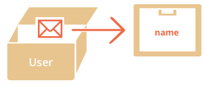

# Объекты: передача по ссылке

Фундаментальным отличием объектов от примитивов, является их хранение и копирование "по ссылке".

[cut]

## Копирование по значению

Обычные значения: строки, числа, булевы значения, `null/undefined` при присваивании переменных копируются целиком или, как говорят, *"по значению"*.

```js
var message = "Привет!";
var phrase = message;
```

В результате такого копирования получились две полностью независимые переменные, в каждой из которых хранится значение `"Привет!"`.


## Копирование по ссылке

С объектами -- всё не так.

**В переменной, которой присвоен объект, хранится не сам объект, а "адрес его места в памяти", иными словами -- "ссылка" на него.**

Вот как выглядит переменная, которой присвоен объект:

```js
var user = {
  name: "Вася"
};
```



Внимание: объект -- вне переменной. В переменной -- лишь "адрес" (ссылка) для него.

**При копировании переменной с объектом -- копируется эта ссылка, а объект по-прежнему остается в единственном экземпляре.**

Например:

```js no-beautify
var user = { name: "Вася" }; // в переменной - ссылка

var admin = user; // скопировали ссылку
```

Получили две переменные, в которых находятся ссылки на один и тот же объект:


**Так как объект всего один, то изменения через любую переменную видны в других переменных:**

```js run
var user = { name: 'Вася' };

var admin = user;

*!*admin.name*/!* = 'Петя'; // поменяли данные через admin

alert(*!*user.name*/!*); // 'Петя', изменения видны в user
```

```smart header="Переменная с объектом как \"ключ\" к сейфу с данными"
Ещё одна аналогия: переменная, в которую присвоен объект, на самом деле хранит не сами данные, а ключ к сейфу, где они хранятся.

При копировании её, получается что мы сделали копию ключа, но сейф по-прежнему один.
```

## Клонирование объектов

Иногда, на практике -- очень редко, нужно скопировать объект целиком, создать именно полную независимую копию, "клон" объекта.

Что ж, можно сделать и это. Для этого нужно пройти по объекту, достать данные и скопировать на уровне примитивов.

Примерно так:

```js run
var user = {
  name: "Вася",
  age: 30
};

*!*
var clone = {}; // новый пустой объект

// скопируем в него все свойства user
for (var key in user) {
  clone[key] = user[key];
}
*/!*

// теперь clone - полностью независимая копия
clone.name = "Петя"; // поменяли данные в clone

alert( user.name ); // по-прежнему "Вася"
```

В этом коде каждое свойство объекта `user` копируется в `clone`. Если предположить, что они примитивны, то каждое скопируется по значению и мы как раз получим полный клон.

Если же свойства объектов, в свою очередь, могут хранить ссылки на другие объекты, то нужно обойти такие подобъекты и тоже склонировать их. Это называют "глубоким" клонированием.

## Вывод в консоли

Откройте консоль браузера (обычно `key:F12`) и запустите следующий код:

```js run
var time = {
  year: 2345,
  month: 11,
  day: 10,
  hour: 11,
  minute: 12,
  second: 13,
  microsecond: 123456
}

console.log(time); // (*)
time.microsecond++; // (**)

console.log(time);
time.microsecond++;

console.log(time);
time.microsecond++;
```

Как видно, в нём некий объект выводится строкой `(*)`, затем он меняется в строке `(**)` и снова выводится, и так несколько раз. Пока ничего необычного, типичная ситуация -- скрипт делает какую-то работу с объектом и выводит в консоли то, как она продвигается.

Необычное -- в другом!

При раскрытии каждый объект будет выглядеть примерно так (скриншот из Chrome):


**Судя по выводу, свойство `microsecond` всегда было равно `123459`... Или нет?**

Если посмотреть на код выше то, очевидно, нет! Это свойство меняется, а консоль нас просто дурит.

**При "раскрытии" свойств объекта в консоли -- браузер всегда выводит их текущие (на момент раскрытия) значения.**

Так происходит именно потому, что вывод не делает "копию" текущего содержимого, а сохраняет лишь ссылку на объект. Запомните эту особенность консоли, в будущем, при отладке скриптов у вас не раз возникнет подобная ситуация.

## Итого

- Объект присваивается и копируется "по ссылке". То есть, в переменной хранится не сам объект а, условно говоря, адрес в памяти, где он находится.
- Если переменная-объект скопирована или передана в функцию, то копируется именно эта ссылка, а объект остаётся один в памяти.

Это -- одно из ключевых отличий объекта от примитива (числа, строки...), который при присвоении как раз копируется "по значению", то есть полностью.

