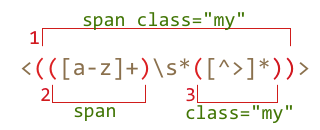

# Скобочные группы

Часть шаблона может быть заключена в скобки `pattern:(...)`. Такие выделенные части шаблона называют "скобочными выражениями" или "скобочными группами".

У такого выделения есть два эффекта:

1. Он позволяет выделить часть совпадения в отдельный элемент массива при поиске через [String#match](https://developer.mozilla.org/ru/docs/Web/JavaScript/Reference/Global_Objects/String/match) или [RegExp#exec](https://developer.mozilla.org/ru/docs/Web/JavaScript/Reference/Global_Objects/RegExp/exec).
2. Если поставить квантификатор после скобки, то он применится *ко всей скобке*, а не всего лишь к одному символу.

[cut]

## Пример

В примере ниже, шаблон `pattern:(go)+` находит один или более повторяющихся `pattern:'go'`:

```js run
alert( 'Gogogo now!'.match(/(go)+/i) ); // "Gogogo"
```

Без скобок, шаблон `pattern:/go+/` означал бы `subject:g`, после которого идёт одна или более `subject:o`, например: `match:goooo`. А скобки "группируют" `pattern:(go)` вместе.

## Содержимое группы

Скобки нумеруются слева направо. Поисковой движок запоминает содержимое каждой скобки и позволяет обращаться к нему -- в шаблоне и строке замены и, конечно же, в результатах.

Например, найти HTML-тег можно шаблоном `pattern:<.*?>`.

После поиска мы захотим что-то сделать с результатом. Для удобства заключим содержимое `<...>` в скобки: `pattern:<(.*?)>`. Тогда оно будет доступно отдельно.

При поиске методом [String#match](https://developer.mozilla.org/ru/docs/Web/JavaScript/Reference/Global_Objects/String/match) в результирующем массиве будет сначала всё совпадение, а далее -- скобочные группы. В шаблоне `pattern:<(.*?)>` скобочная группа только одна:

```js run
var str = '<h1>Привет, мир!</h1>';
var reg = /<(.*?)>/;

alert( str.match(reg) ); // массив: <h1>, h1
```

Заметим, что метод [String#match](https://developer.mozilla.org/ru/docs/Web/JavaScript/Reference/Global_Objects/String/match) выдаёт скобочные группы только при поиске без флага `/.../g`. В примере выше он нашёл только первое совпадение `match:<h1>`, а закрывающий `match:</h1>` не нашёл, поскольку без флага `/.../g` ищется только первое совпадение.

Для того, чтобы искать и с флагом `/.../g` и со скобочными группами, используется метод [RegExp#exec](https://developer.mozilla.org/ru/docs/Web/JavaScript/Reference/Global_Objects/RegExp/exec):

```js run
var str = '<h1>Привет, мир!</h1>';
var reg = /<(.*?)>/g;

var match;

while ((match = reg.exec(str)) !== null) {
  // сначала выведет первое совпадение: <h1>,h1
  // затем выведет второе совпадение: </h1>,/h1
  alert(match);
}
```

Теперь найдено оба совпадения `pattern:<(.*?)>`, каждое -- массив из полного совпадения и скобочных групп (одна в данном случае).

## Вложенные группы
Скобки могут быть и вложенными. В этом случае нумерация также идёт слева направо.

Например, при поиске тега в `subject:<span class="my">` нас может интересовать:

1. Содержимое тега целиком: `span class="my"`.
2. В отдельную переменную для удобства хотелось бы поместить тег: `span`.
3. Также может быть удобно отдельно выделить атрибуты `class="my"`.

Добавим скобки в регулярное выражение:

```js run
var str = '<span class="my">';

var reg = /<(([a-z]+)\s*([^>]*))>/;

alert( str.match(reg) ); // <span class="my">, span, s
```

Вот так выглядят скобочные группы:



На нулевом месте -- всегда совпадение полностью, далее -- группы. Нумерация всегда идёт слева направо, по открывающей скобке.

В данном случае получилось, что группа 1 включает в себя содержимое групп 2 и 3. Это совершенно нормальная ситуация, которая возникает, когда нужно выделить что-то отдельное внутри большей группы.

**Даже если скобочная группа необязательна и не входит в совпадение, соответствующий элемент массива существует (и равен `undefined`).**

Например, рассмотрим регэксп `pattern:a(z)?(c)?`. Он ищет `"a"`, за которой не обязательно идёт буква `"z"`, за которой необязательно идёт буква `"c"`.

Если напустить его на строку из одной буквы `"a"`, то результат будет таков:

```js run
var match = 'a'.match(/a(z)?(c)?/)

alert( match.length ); // 3
alert( match[0] ); // a
alert( match[1] ); // undefined
alert( match[2] ); // undefined
```

Массив получился длины `3`, но все скобочные группы -- `undefined`.

А теперь более сложная ситуация, строка `subject:ack`:

```js run
var match = 'ack'.match(/a(z)?(c)?/)

alert( match.length ); // 3
alert( match[0] ); // ac, всё совпадение
alert( match[1] ); // undefined, для (z)? ничего нет
alert( match[2] ); // c
```

Длина массива результатов по-прежнему `3`. Она постоянна. А вот для скобочной группы `pattern:(z)?` в ней ничего нет, поэтому результат: `["ac", undefined, "c"]`.

## Исключение из запоминания через ?:

Бывает так, что скобки нужны, чтобы квантификатор правильно применился, а вот запоминать её в массиве не нужно.

Скобочную группу можно исключить из запоминаемых и нумеруемых, добавив в её начало `pattern:?:`.

Например, мы хотим найти `pattern:(go)+`, но содержимое скобок (`go`) в отдельный элемент массива выделять не хотим.

Для этого нужно сразу после открывающей скобки поставить `?:`, то есть: `pattern:(?:go)+`.

Например:

```js run
var str = "Gogo John!";
*!*
var reg = /(?:go)+ (\w+)/i;
*/!*

var result = str.match(reg);

alert( result.length ); // 2
alert( result[1] ); // John
```

В примере выше массив результатов имеет длину `2` и содержит только полное совпадение и результат `pattern:(\w+)`. Это удобно в тех случаях, когда содержимое скобок нас не интересует.
