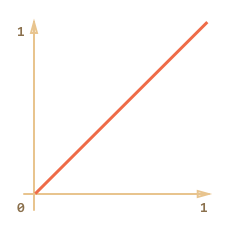
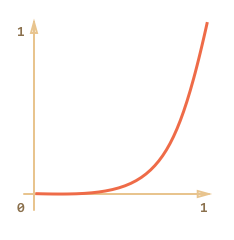
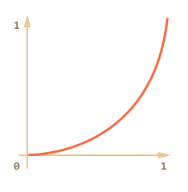
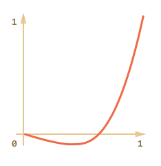
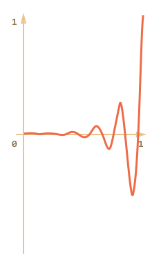
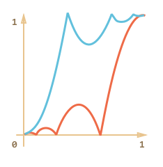
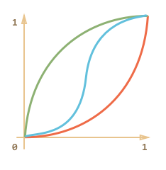

# JS-Анимация

JavaScript-анимация применяется там, где не подходит CSS.

Например, по сложной траектории, с временной функцией, выходящей за рамки кривых Безье, на canvas. Иногда её используют для анимации в старых IE.

[cut]

## setInterval

С точки зрения HTML/CSS, анимация -- это постепенное изменение стиля  DOM-элемента. Например, увеличение координаты `style.left` от `0px` до `100px` сдвигает элемент.

Если увеличивать `left` от `0` до `100` при помощи `setInterval`, делая по 50 изменений в секунду, то это будет выглядеть как плавное перемещение. Тот же принцип, что и в кино: для непрерывной анимации достаточно 24 или больше вызовов `setInterval` в секунду.

Псевдо-код для анимации выглядит так:

```js
var fps = 50; // 50 кадров в секунду
var timer = setInterval(function() {
  if (время вышло) clearInterval(timer);
  else немного увеличить left
}, 1000 / fps)
```

Более полный пример кода анимации:

```js
var start = Date.now(); // сохранить время начала

var timer = setInterval(function() {
  // вычислить сколько времени прошло с начала анимации
  var timePassed = Date.now() - start;

  if (timePassed >= 2000) {
    clearInterval(timer); // конец через 2 секунды
    return;
  }

  // рисует состояние анимации, соответствующее времени timePassed
  draw(timePassed);

}, 20);

// в то время как timePassed идёт от 0 до 2000
// left принимает значения от 0 до 400px
function draw(timePassed) {
  train.style.left = timePassed / 5 + 'px';
}
```

Кликните для демонстрации:

[codetabs height=200 src="move"]

## requestAnimationFrame

Если у нас не один такой `setInterval`, а несколько в разных местах кода, то браузеру нужно в те же 20мс работать со страницей уже несколько раз. А ведь кроме `setInterval` есть ещё другие действия, к примеру, прокрутка страницы, которую тоже надо нарисовать.

Если все действия по перерисовке производить независимо, то будет выполняться много двойной работы.

Гораздо выгоднее с точки зрения производительности -- сгруппировать все перерисовки в одну и запускать их централизованно, все вместе.

Для этого в JavaScript-фреймворках, которые поддерживают анимацию, есть единый таймер:

```js
setInterval(function() {
  /* отрисовать все анимации */
}, 20);
```

...Все анимации, которые запускает такой фреймворк, добавляются в общий список, и раз в 20мс единый таймер проверяет его, запускает текущие, удаляет завершившиеся.

Современные браузеры, кроме IE9-, поддерживают стандарт [Animation timing](http://www.w3.org/TR/animation-timing/), который представляет собой дальнейший шаг в этом направлении. Он позволяет синхронизировать наши анимации со встроенными механизмами обновления страницы. То есть, сгруппированы будут не только наши, но и CSS-анимации и другие браузерные перерисовки.

При этом графический ускоритель будет использован максимально эффективно, и исключена повторная обработка одних и тех же участков страницы. А значит -- меньше будет загрузка CPU, да и сама анимация станет более плавной.

Для этого используется функция [requestAnimationFrame](http://www.w3.org/TR/animation-timing/#dom-windowanimationtiming-requestanimationframe).

Синтаксис:
```js
var requestId = requestAnimationFrame(callback)
```

Такой вызов планирует запуск `callback` в ближайшее время, когда браузер сочтёт возможным осуществить анимацию.

Если запланировать в `callback` какое-то рисование, то оно будет сгруппировано с другими `requestAnimationFrame` и с внутренними перерисовками браузера.

Возвращаемое значение `requestId` служит для отмены запуска:
```js
// отменить запланированное выше выполнение callback
cancelAnimationFrame(requestId);
```

Функция `callback` получает один аргумент -- время, прошедшее с начала загрузки страницы, результат вызова [performance.now()](https://developer.mozilla.org/en-US/docs/Web/API/Performance/now).

Как правило, запуск `callback` происходит очень скоро. Если у процессора большая загрузка или батарея у ноутбука почти разряжена -- то пореже.

Если вы запустите этот код, то увидите промежутки между первыми 20 запусками `requestAnimationFrame`. Как правило, это 10-20мс, но бывает и больше и меньше. Это оптимальная частота анимации с точки зрения браузера.

```html run height=40 refresh
<script>
  var prev = performance.now();
  var times = 0;

  requestAnimationFrame(function measure(time) {
    document.body.insertAdjacentHTML("beforeEnd", Math.floor(time - prev) + " ");
    prev = time;

    if (times++ < 10) requestAnimationFrame(measure);
  })
</script>
```

Функция анимации на основе `requestAnimationFrame`:

```js
// Рисует функция draw
// Продолжительность анимации duration
function animate(draw, duration) {
  var start = performance.now();

  requestAnimationFrame(function animate(time) {
    // определить, сколько прошло времени с начала анимации
    var timePassed = time - start;

    // возможно небольшое превышение времени, в этом случае зафиксировать конец
    if (timePassed > duration) timePassed = duration;

    // нарисовать состояние анимации в момент timePassed
    draw(timePassed);

    // если время анимации не закончилось - запланировать ещё кадр
    if (timePassed < duration) {
      requestAnimationFrame(animate);
    }

  });
}
```

Использование для поезда:
```js
animate(function(timePassed) {
  train.style.left = timePassed / 5 + 'px';
}, 2000);
```

В действии:

[codetabs src="move-raf"]

## Структура анимации

На основе `requestAnimationFrame` можно соорудить и гораздо более мощную, но в то же время простую функцию анимации.

У анимации есть три основных параметра:

`duration`
: Общее время, которое должна длиться анимация, в мс. Например, `1000`.

`timing(timeFraction)`
: Временная функция, которая, по аналогии с CSS-свойством `transition-timing-function`, будет по текущему времени вычислять состояние анимации.

    Она получает на вход непрерывно возрастающее число `timeFraction` -- от `0` до `1`, где `0` означает самое начало анимации, а `1` -- её конец.

    Её результатом должно быть значение завершённости анимации, которому в CSS transitions на кривых Безье соответствует координата `y`.

    Также по аналогии с `transition-timing-function` должны соблюдаться условия:

- timing(0) = 0
- timing(1) = 1

    ...То есть, анимация начинается в точке `(0,0)` -- нулевое время и нулевой прогресс и заканчивается в `(1, 1)` -- прошло полное время, и процесс завершён.

    Например, функция-прямая означает равномерное развитие процесса:
    ```js
    function linear(timeFraction) {
      return timeFraction;
    }
    ```

    Её график:


    Как видно, её график полностью совпадает с `transition-timing-function: linear`, и эффект абсолютно такой же.

    Есть и другие, более интересные варианты, мы рассмотрим их чуть позже.

`draw(progress)`
: Функция, которая получает состояние завершённости анимации и рисует его. Значению `progress=0` соответствует начальная точка анимации, `progress=1` -- конечная.

    Именно эта функция и осуществляет, собственно, анимацию.

    Например, может двигать элемент:
    ```js
    function draw(progress) {
      train.style.left = progress + 'px';
    }
    ```

    Возможны любые варианты, анимировать можно что угодно и как угодно.

Анимируем ширину элемента `width` от `0` до `100%`, используя нашу функцию.

Кликните для демонстрации:

[codetabs height=60 src="width"]

Код для запуска анимации:

```js
animate({
  duration: 1000,
  timing: function(timeFraction) {
    return timeFraction;
  },
  draw: function(progress) {
    elem.style.width = progress * 100 + '%';
  }
});
```

## Временные функции

Выше мы видели самую простую, линейную временную функцию.

Рассмотрим примеры анимации движения с использованием различных `timing`.

### В степени n

Вот еще один простой случай -- `progress` в степени `n`. Частные случаи - квадратичная, кубическая функции и т.д.

Для квадратичной функции:

```js
function quad(progress) {
  return Math.pow(progress, 2)
}
```

**График квадратичной функции:**


Пример для квадратичной функции (клик для просмотра):

[iframe height=40 src="quad" link]

Увеличение степени влияет на ускорение. Например, график для 5-й степени:



В действии:

[iframe height=40 src="quint" link]

### Дуга

Функция:

```js
function circ(timeFraction) {
  return 1 - Math.sin(Math.acos(timeFraction))
}
```

**График:**



[iframe height=40 src="circ" link]

### Back: стреляем из лука

Эта функция работает по принципу лука: сначала мы "натягиваем тетиву", а затем "стреляем".

В отличие от предыдущих функций, эта зависит от дополнительного параметра `x`, который является "коэффициентом упругости". Он определяет расстояние, на которое "оттягивается тетива".

Её код:

```js
function back(x, timeFraction) {
  return Math.pow(timeFraction, 2) * ((x + 1) * timeFraction - x)
}
```

**График для `x = 1.5`:**



Пример для `x = 1.5`:

[iframe height=40 src="back" link]

### Отскок bounce

Представьте, что мы отпускаем мяч, он падает на пол, несколько раз отскакивает и останавливается.

Функция `bounce` делает то же самое, только наоборот: "подпрыгивание" начинается сразу.

Эта функция немного сложнее предыдущих и использует специальные коэффициенты:

```js
function bounce(timeFraction) {
  for (var a = 0, b = 1, result; 1; a += b, b /= 2) {
    if (timeFraction >= (7 - 4 * a) / 11) {
      return -Math.pow((11 - 6 * a - 11 * timeFraction) / 4, 2) + Math.pow(b, 2)
    }
  }
}
```

Код взят из MooTools.FX.Transitions. Конечно же, есть и другие реализации `bounce`.

Пример:

[iframe height=40 src="bounce" link]

### Упругая анимация

Эта функция зависит от дополнительного параметра `x`, который определяет начальный диапазон.

```js
function elastic(x, timeFraction) {
  return Math.pow(2, 10 * (timeFraction - 1)) * Math.cos(20 * Math.PI * x / 3 * timeFraction)
}
```

**График для `x=1.5`:**


Пример для `x=1.5`:

[iframe height=40 src="elastic" link]

## Реверсивные функции ease*

Итак, у нас есть коллекция временных функций.

Их прямое использование называется "easeIn".

**Иногда нужно показать анимацию в обратном режиме. Преобразование функции, которое даёт такой эффект, называется "easeOut"**.

### easeOut

В режиме "easeOut", значение timing вычисляется по формуле: `timingEaseOut(timeFraction) = 1 - timing(1 - timeFraction)`

Например, функция `bounce` в режиме "easeOut":

```js
// обычный вариант
function bounce(timeFraction) {
  for (var a = 0, b = 1, result; 1; a += b, b /= 2) {
    if (timeFraction >= (7 - 4 * a) / 11) {
      return -Math.pow((11 - 6 * a - 11 * timeFraction) / 4, 2) + Math.pow(b, 2);
    }
  }
}

// преобразователь в easeOut
function makeEaseOut(timing) {
  return function(timeFraction) {
    return 1 - timing(1 - timeFraction);
  }
}

*!*
var bounceEaseOut = makeEaseOut(bounce);
*/!*
```

Полный пример -- откок в `bounceEaseOut` теперь не в начале, а в конце (и это куда красивее):

[codetabs src="bounce-easeout"]

На этом графике видно, как преобразование `easeOut` изменяет поведение функции:



Если есть анимационный эффект, такой как подпрыгивание -- он будет показан в конце, а не в начале (или наоборот, в начале, а не в конце).

Красным цветом обозначен <span style="color:#EE6B47">обычный вариант</span>, а <span style="color:#62C0DC">синим</span> -- `easeOut`.

- Обычно анимируемый объект сначала медленно скачет внизу, а затем, в конце, резко достигает верха..
- А после `easeOut` -- он сначала прыгает наверх, а затем медленно скачет внизу.

### easeInOut

А еще можно сделать так, чтобы показать эффект *и в начале и в конце* анимации. Соответствующее преобразование называется "easeInOut".

Его код выглядит так:

```js
if (timeFraction <= 0.5) { // первая половина анимации)
  return timing(2 * timeFraction) / 2;
} else { // вторая половина
  return (2 - timing(2 * (1 - timeFraction))) / 2;
}
```

Код, который трансформирует `timing`:

```js
function makeEaseInOut(timing) {
  return function(timeFraction) {
    if (timeFraction < .5)
      return timing(2 * timeFraction) / 2;
    else
      return (2 - timing(2 * (1 - timeFraction))) / 2;
  }
}

bounceEaseInOut = makeEaseInOut(bounce);
```

Пример с `bounceEaseInOut`:

[codetabs src="bounce-easeinout"]

Трансформация "easeInOut" объединяет в себе два графика в один: `easeIn` для первой половины анимации и `easeOut` -- для второй.

Это отлично видно, если посмотреть графики `easeIn`, `easeOut` и `easeInOut` на примере функции `circ`:



- <span style="color:#EE6B47">Красным</span> цветом обозначен обычный вариант функции `circ`.
- <span style="color:#8DB173">Зелёным</span> -- `easeOut`.
- <span style="color:#62C0DC">Синим</span> -- `easeInOut`.

Как видно, график первой половины анимации представляет собой уменьшенный "easeIn", а второй -- уменьшенный "easeOut". В результате, анимация начинается и заканчивается одинаковым эффектом.

```summary
Процесс анимации полностью в ваших руках благодаря `timing`. Её можно сделать настолько реалистичной, насколько захочется.

Впрочем, исходя из практики, можно сказать, что варианты `timing`, описанные выше, покрывают 95% потребностей в анимации.
```

## Сложные варианты step

Анимировать можно все, что угодно. Вместо движения, как во всех предыдущих примерах, можно изменять любые CSS свойства... И не только!

Достаточно лишь написать соответствующий `draw`.

### Набор текста

Можно, к примеру, анимировать набор текста в "скачущем" режиме:

[codetabs src="text"]

## Итого

Анимация выполняется путём вызовов `requestAnimationFrame`. Для поддержки IE9- желательно подключить полифилл, который будет внутри использовать `setTimeout`. Это будет всё равно лучше, чем независимые `setInterval`.

Реализация анимации -- очень простая и вместе с тем гибкая:

```js
function animate(options) {

  var start = performance.now();

  requestAnimationFrame(function animate(time) {
    // timeFraction от 0 до 1
    var timeFraction = (time - start) / options.duration;
    if (timeFraction > 1) timeFraction = 1;

    // текущее состояние анимации
    var progress = options.timing(timeFraction)

    options.draw(progress);

    if (timeFraction < 1) {
      requestAnimationFrame(animate);
    }

  });
}
```

Основные параметры:

- `duration` -- длительность анимации в мс.
- `timing` -- функция, которая определяет состояние анимации каждый кадр. Получает часть времени от 0 до 1, возвращает завершенность анимации от 0 до 1.
- `draw` -- функция, которая отрисовывает состояние анимации от 0 до 1.

Эту функцию можно улучшить, например добавить коллбэк `complete` для вызова в конце анимации.

Мы рассмотрели ряд примеров для `timing` и  трансформации `easeOut`, `easeInOut`, которые позволяют их разнообразить. В отличие от CSS мы не ограничены кривыми Безье, можно реализовать всё, что угодно.

Это же относится и к функции `draw`.

Такая реализация анимации имеет три основных области применения:

- Нестандартные задачи и требования, не укладывающиеся в рамки CSS.
- Поддержка IE9-.
- Графика, рисование на canvas.

